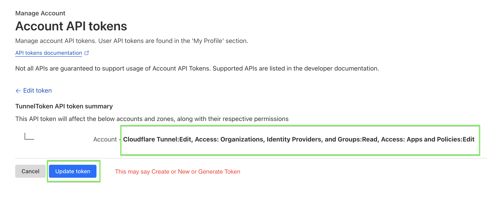

These are the instructions on how to, once you have a Cloudflare account, generate the tunnel token that will enable you to use your Raspberry Pi home inventory system from anywhere.

## Step 1
Click the search box and type "API" - you'll see a link to your API. Click that.

## Step 2
Navigate to the account API tokens page. If you're not already there, click the link that appears.

## Step 3
Click "Create token"

## Step 4
In the list, you'll see "Create Custom Token". When you click that, you'll get several dropdown menus to configure. The result will be these three items on your page:

## Step 5
Continue to the summary page. It may say "Generate token" here. Regardless, review the steps below before proceeding. You'll be given a copy-paste command and receive your token. **Save this token somewhere secure** - you'll need it if you ever need to regenerate it. You can create new tokens, but they'll be completely different, requiring you to go through the tunnel generation process again.

## Step 6
You may reach this page during the workflow. If it says "Generate token here" on your first time through, that's normal. This screenshot shows a subsequent visit.

## Step 7
Finally, you'll reach a page like this where you can copy your token. If you're comfortable with command line tools on Mac or Linux, you can run the validation command they provide to test your token.

## Next Steps
Return to the app and enter this tunnel token along with your email address in the tunnel creation section. Your email address is special because it's the one that will receive the one-time access tokens. When you use the generated URL (on nestdb.io with your Pi name), enter that same email address on the login page. You'll receive a 6-digit code via email - enter this code to gain access to your Pi Inventory. Tunnels stay active for 24 hours, after which you'll need to request a new token.

## Important Notes & Cautions

**This feature is brand new and has only been tested on my personal setup.** I need feedback on:
- Are the required tokens reasonable and secure?
- How is the overall experience?

**Security Features:**
- Tokens are locked to your email address with one-time authentication
- Family member email sharing is available but untested
- Family member removal is also available but untested

**Technical Details:**
- The system is designed to be idempotent - if you wipe your Pi and rebuild, it will reuse the same token if provided
- If an existing tunnel is detected, it will attempt to reuse it
- DNS names are generated based on your Pi's serial number, so different Pis get different names
- **Unknown**: Whether multiple Pis can run tunnels simultaneously (currently only "Highlander rules" - there can be only one)
- Each Cloudflare account can have one tunnel

**Feedback Welcome:** If you have more Cloudflare expertise than I do, I'd appreciate your input on the security and configuration choices made.

**About DNS names** The DNS name that's generated is hosted by my Cloudflare account, nestdbio. I'm not exactly sure, but you may be able to do this if you have your own Cloudflare account with your own DNS. Create a record that points to your tunnel as a proxy record (not as a CNAME, not as an A record). There's one type called proxy that may work. Like a lot of things, untested.